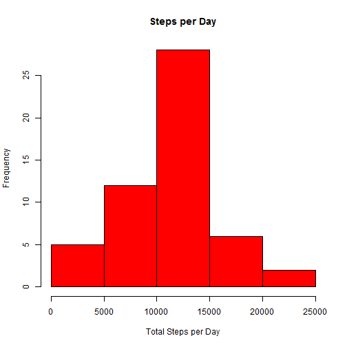
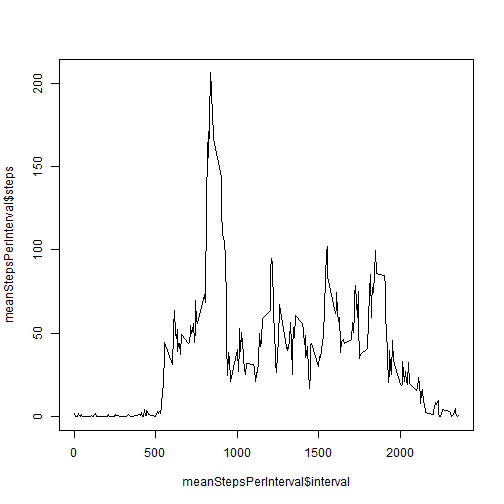
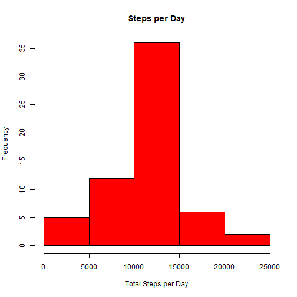

# Reproducible Research: Peer Assessment 1


## Loading and preprocessing the data

### Set the working directory
setwd ("D:\\cursuri\\ReproducibleResearch\\PeerAssessment1\\RepData_PeerAssessment1");

* Load data into activity data frame

```r
activity <- read.csv("activity.csv", header = TRUE, colClasses = c("numeric", 
    "character", "integer"))
```


* Set the date field to date data type

```r
activity$date <- as.Date(activity$date, "%Y-%m-%d")
```


## What is mean total number of steps taken per day?

* Calculate the total number of steps per day

```r
StepsPerDay <- aggregate(steps ~ date, data = activity, FUN = sum, na.rm = TRUE)
```


* draw the histogram for the number of steps per day

```r
hist(StepsPerDay$steps, freq = TRUE, col = "red", main = "Steps per Day", xlab = "Total Steps per Day")
```

 


* Calculate the mean for the total number of steps per day

```r
mean(StepsPerDay$steps)
```

```
## [1] 10766
```


* Calculate the median for the total number of steps per day

```r
median(StepsPerDay$steps)
```

```
## [1] 10765
```


## What is the average daily activity pattern?

### Make a time series plot (i.e. type = "l") of the 5-minute interval (x-axis) and the average number of steps taken, averaged across all days (y-axis)

* Calculate the average number of steps per interval

```r
meanStepsPerInterval <- aggregate(steps ~ interval, data = activity, FUN = mean, 
    na.rm = TRUE)
```


* Draw a time serie graph with interval on x-axis and the average of number of steps per interval on y-axis

```r
plot(meanStepsPerInterval$interval, meanStepsPerInterval$steps, type = "l", 
    main = "Average number of steps per 5 min interval", xlab = "Interval (5 minutes)", 
    ylab = "Average number of steps")
```

 


* Find the 5-minute interval which contains the maximum average number of steps

```r
meanStepsPerInterval[which.max(meanStepsPerInterval$steps), ]$interval
```

```
## [1] 835
```


## Imputing missing values

### Calculate and report the total number of missing values in the dataset (i.e. the total number of rows with NAs)


```r
sum(is.na(activity$steps))
```

```
## [1] 2304
```


### Devise a strategy for filling in all of the missing values in the dataset. The strategy does not need to be sophisticated. For example, you could use the mean/median for that day, or the mean for that 5-minute interval, etc.

* use the average number of steps for the interval to replace the missing value
* define function to return the average number of steps based on interval

```r
meanSteps <- function(interval) {
    meanStepsPerInterval[which(meanStepsPerInterval$interval == interval), ]$steps
}
```


* duplicate the activity data frame

```r
activityAssigned <- activity
```


* update the missing value for steps column with the average number of steps for the same interval

```r
activityAssigned[which(is.na(activityAssigned)), ]$steps <- sapply(activityAssigned[which(is.na(activityAssigned)), 
    ]$interval, FUN = meanSteps)
```


### Make a histogram of the total number of steps taken each day and Calculate and report the mean and median total number of steps taken per day. Do these values differ from the estimates from the first part of the assignment? What is the impact of imputing missing data on the estimates of the total daily number of steps?

* Calculate the total number of steps per day

```r
StepsPerDayAssigned <- aggregate(steps ~ date, data = activityAssigned, FUN = sum)
```

* Draw the histogram for the number of steps per day with missing values assigned

```r
hist(StepsPerDayAssigned$steps, freq = TRUE, col = "red", main = "Steps per Day", 
    xlab = "Total Steps per Day")
```

 


* Calculate the mean for the total number of steps per day with missing values assigned

```r
mean(StepsPerDayAssigned$steps)
```

```
## [1] 10766
```


* Calculate the median for the total number of steps per day with missing values assigned

```r
median(StepsPerDayAssigned$steps)
```

```
## [1] 10766
```


## Are there differences in activity patterns between weekdays and weekends?

## Create a new factor variable in the dataset with two levels - "weekday" and "weekend" indicating whether a given date is a weekday or weekend day.

* Create a function to differenciate between weekday and week-end

```r
weekend <- function(date) {
    DayOfWeek <- weekdays(date)
    if (DayOfWeek == "Sunday" | DayOfWeek == "Saturday") {
        "weekend"
    } else {
        "weekday"
    }
}
```


* Create a daytype column for the activityAssigned data frame
* the daytype is a factor data type with two levels: weekday and weekend 

```r
activityAssigned$daytype <- sapply(activityAssigned$date, FUN = weekend)
activityAssigned$daytype <- as.factor(activityAssigned$daytype)
```


### Make a panel plot containing a time series plot (i.e. type = "l") of the 5-minute interval (x-axis) and the average number of steps taken, averaged across all weekday days or weekend days (y-axis). The plot should look something like the following, which was creating using simulated data

* calculate the average number of steps for interval during the weekday and weekend

```r
meanstepsPerWeekday <- aggregate(steps ~ interval + daytype, activityAssigned, 
    mean, na.rm = TRUE)
```


* load the lattice library

```r
library(lattice)
```


* draw the plot for average number of steps per interval in weekday and weekend

```r
xyplot(steps ~ interval | factor(daytype), data = meanstepsPerWeekday, aspect = 1/2, 
    type = "l")
```

 


